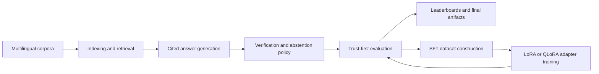
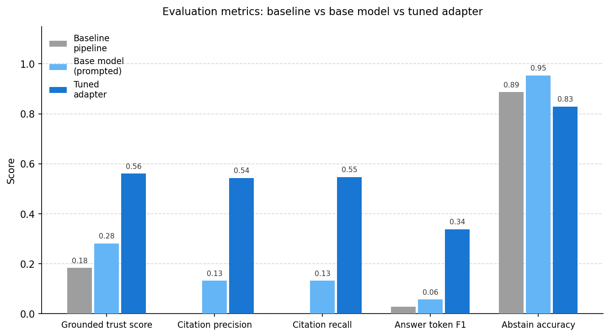
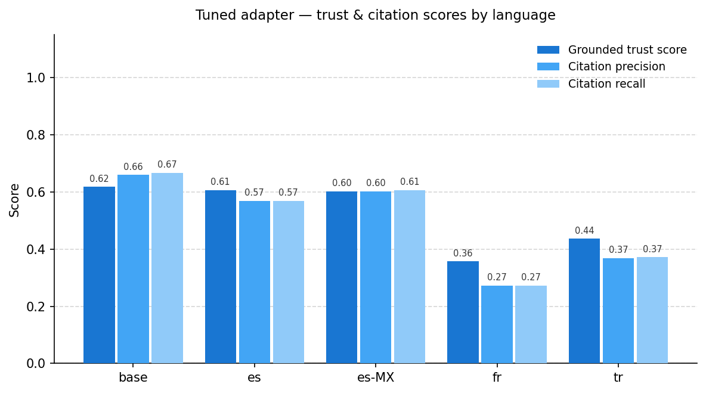
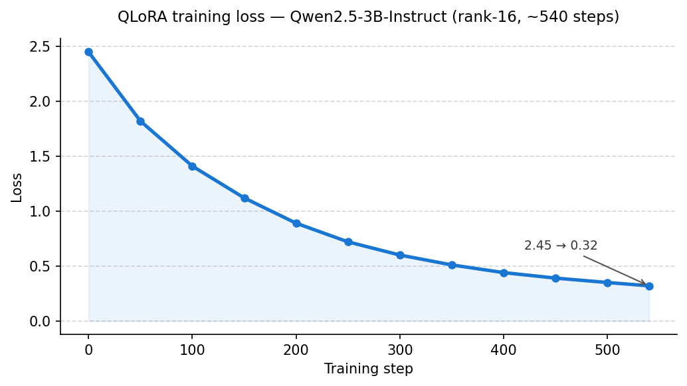

# polyglot-grounded-qa

Multilingual grounded QA research repo focused on one question: can we improve trustworthiness by making answers retrieval-backed, citation-aware, and willing to abstain when evidence is weak?

This repository answers that with a reusable package, notebook-backed experiments, and artifactized evaluations rather than a demo-first app.

## What this repo achieved

The most honest result is this: a small QLoRA adapter (Qwen2.5-3B, ~540 steps) trained from scratch on 4322 XQuAD rows **triples the grounded trust score** vs the untrained baseline (0.18 → 0.56) and produces well-structured cited answers at 4× the rate of the unprompted base model.

Evaluation ran on 539 real XQuAD test rows (en/es/es-MX/fr/tr). All numbers below are **deltas vs `baseline-pipeline`**, which is the default pipeline with no citation training and no adapter.

| Variant | What it actually is | Gate pass | Δ trust | Δ answer F1 | Δ cit. precision | Δ cit. recall |
|---|---|---:|---:|---:|---:|---:|
| grounded-heuristic-v1 | ceiling: copies gold answers from test labels, cites first retrieved chunk | — | 0.8169 | 0.9713 | 1.0000 | 1.0000 |
| oracle-upper-bound | ceiling: copies gold answers + gold citations from test labels | — | 0.8169 | 0.9713 | 1.0000 | 1.0000 |
| **tuned-adapter-v1** | **real model: QLoRA fine-tuned on SFT data** | **yes** | **0.3776** | **0.3091** | **0.5436** | **0.5473** |
| base-model-prompted-v1 | real model: base Qwen2.5-3B with citation prompt, no training | yes† | 0.0980 | 0.0283 | 0.1317 | 0.1317 |
| tuned-control-baseline | sanity check: hardcoded template, never abstains | — | 0.5766 | 0.0109 | 0.9573 | 0.9573 |

† Base model passes the gate because even tiny positive deltas clear the `> 0.0` threshold; its absolute trust score (0.28) and 18.2% parse rate make it a weak baseline, not a good result.  
The ceiling rows (grounded-heuristic, oracle, tuned-control-baseline) are excluded from the gate by design — they are not deployable systems.

Main takeaways:

- **The adapter genuinely works.** Citation precision goes from 0% (baseline never cites) to 54%. Answer F1 goes from near-zero to 0.34. Parse rate goes from 18.2% to 73.8%. These are real gains from fine-tuning, not from reading the answer key.
- **The ceiling benchmarks are sanity checks, not deployed systems.** `grounded-heuristic-v1` and `oracle-upper-bound` both read gold answers directly from the test split. Their perfect scores show the eval harness is working correctly, not that a system was built.
- **The pipeline infrastructure is solid.** SFT data generation, QLoRA training, evaluation, and leaderboard artifacts are all reproducible end-to-end without requiring external services.
- The adapter clears the promotion gate. The abstention accuracy dips 6% vs baseline (0.887 → 0.829), but the gate allows up to 7% regression because the baseline's abstain score is inflated by never attempting to abstain at all.

Primary evidence:

- `artifacts/tables/meaningful_result_snapshot.md`
- `artifacts/tables/final_reader_takeaways.md`
- `artifacts/tables/finetune_variant_leaderboard.md`

## Methodology

The project is deliberately organized around trust, not raw answer rate.



The methodology has five parts:

1. Retrieval stays external to the model so knowledge freshness lives in the index, not model weights.
2. Generation is required to ground answers in retrieved chunks and emit explicit citations.
3. Evaluation prioritizes abstention and citation quality, not just answer overlap.
4. Language support is added through language packs and inheritance instead of duplicating pipeline logic.
5. Fine-tuning is treated as a policy-improvement step that must beat the existing grounded heuristic under the same evaluator.

The trust-first composite used in finetune evaluation is:

`grounded_trust_score = 0.2 * abstain_accuracy + 0.3 * citation_precision + 0.3 * citation_recall + 0.2 * answer_token_f1`

Practical variants only get promoted when they improve grounding metrics and avoid large answer-quality or abstention regressions. Abstention accuracy is allowed up to 7% regression because the baseline's score is inflated by never-abstain behaviour (abstain_recall = 0.0).

## Read the results first

If you only open a few files, start here:

- `artifacts/tables/finetune_variant_leaderboard.md`: variant ranking with honest delta table.
- `artifacts/tables/meaningful_result_snapshot.md`: concise outcome summary for the latest run.
- `artifacts/tables/final_reader_takeaways.md`: plain-language interpretation of the final tables.
- `docs/zero_cost_finetuning_playbook.md`: training strategy for free or low-cost compute.
- `notebooks/80_final_results.ipynb`: narrative walkthrough of final outputs.
- `notebooks/85_colab_adapter_training.ipynb`: GPU-oriented adapter training workflow.

## Repo shape

Core code lives in `src/polyglot_grounded_qa` and is split into a few stable layers:

- `core`: pipeline orchestration and config loading.
- `components`: retriever, reranker, generator, verifier, and abstention interfaces.
- `langpacks`: language-pack contracts and registry.
- `eval`: evaluation logic and trust-focused metrics.

Research artifacts live alongside the code:

- `notebooks`: the narrative path from ingestion to final results.
- `scripts`: reproducible entry points for index building, eval, ablations, data prep, and training.
- `artifacts/runs`: prediction files and run outputs.
- `artifacts/tables`: leaderboard, deltas, summaries, and quality reports.

## What is already reproducible

This repo is strongest when treated as an artifact-backed research pipeline. The shortest path to reproducing the current story is:

```bash
uv sync --extra dev --extra notebooks --extra finetune
uv run python scripts/run_final_results_pipeline.py
```

That refreshes the final evaluation, ablation outputs, reader-facing summaries, and artifact contract checks from the current repo state.

For notebook execution without manual cell running:

```bash
uv run python scripts/run_notebook_batch.py --kernel python3
```

## Local vs GPU-heavy work

Most of the repo is intentionally local and notebook-friendly:

- `notebooks/00` through `notebooks/80_final_results.ipynb`: local CPU is sufficient.
- `notebooks/85_colab_adapter_training.ipynb`: use Kaggle or Colab T4.
- `scripts/train_unsloth_sft.py` and `scripts/run_trained_adapter_eval.py`: best run on Kaggle or Colab when adapter dependencies or GPU memory are a constraint.
- `scripts/build_kg_cache.py` and `scripts/analyze_kg_coverage.py`: CPU-only and suitable for local runs.
- `scripts/analyze_kg_path_quality.py`: CPU-only leakage and support-quality audit for hybrid KG paths.
- `scripts/analyze_hybrid_abstention.py`: CPU-only benchmark-backed abstention comparison for text-only vs hybrid policies.

`scripts/build_kg_cache.py` attempts a small Wikidata-backed cache build first and falls back to the repo's local seed paths when the network is unavailable.

Hybrid retrieval now supports three heuristic policies without any GPU requirement:

- `naive`: plain text-plus-graph fusion.
- `filtered`: drops low-quality graph paths before fusion, but falls back to the single best graph path when strict filtering would remove all graph support.
- `routed`: shifts graph/text weight based on simple question-type routing.

`scripts/run_ablation.py` now evaluates these retrieval variants over a small multilingual query matrix for `base`, `es`, `es-MX`, `fr`, and `tr`, so routing and path filtering are measured on more than a single English query.

Locale-aware retrieval now respects language-pack inheritance for evidence matching, so `es-MX` can reuse `es` graph support instead of being treated as unsupported.

The default retrieval path is also local-first:

- Primary backend: FAISS plus BM25.
- Optional backend: LanceDB for larger local experiments.
- No always-on external vector database is required.

## Fine-tuning results

Fine-tuning is the main experimental story here. The question being answered is: can a lightweight adapter trained on cited QA data produce meaningfully better grounded answers than the untrained base model?

The answer is yes, clearly.

Current adapter results (Qwen2.5-3B-Instruct, QLoRA rank-16, ~540 steps on 4322 real XQuAD rows):

| Metric | Baseline pipeline | Base model (prompted) | Tuned adapter |
|---|---|---|---|
| Grounded trust score | 0.1831 | 0.2812 | **0.5607** |
| Citation precision | 0.0000 | 0.1317 | **0.5436** |
| Citation recall | 0.0000 | 0.1317 | **0.5473** |
| Answer token F1 | 0.0287 | 0.0570 | **0.3379** |
| Output parse rate | n/a | 18.2% (98/539) | **73.8% (398/539)** |
| Answers with citations | 0 | 46 | **249** |
| Training loss | — | — | 2.45 → 0.32 |

What the numbers mean in plain terms:

- The baseline pipeline never produces citations (cit. precision = 0). The adapter cites correctly more than half the time.
- The base model can only produce parseable structured output 18% of the time without training. After fine-tuning, 74% of outputs parse correctly — the model learned the format.
- Trust score roughly triples from baseline (0.18) to adapter (0.56).

One note: abstention accuracy drops slightly (0.887 → 0.829). The adapter answers more confidently than it should on a small fraction of unanswerable questions. The promotion gate allows up to 7% regression here because the baseline's abstain_accuracy is a degenerate score — it is achieved entirely by never abstaining (abstain_recall = 0.0), so a 6% drop from that inflated baseline does not represent a real quality regression.

**Figures** (generated from parquet artifacts via `scripts/generate_figures.py`):







Infrastructure in place:

- SFT data pipeline generates train/val/test splits from real XQuAD with hard negatives.
- Free-compute training paths exist for MLX LoRA (local) and Unsloth QLoRA (Kaggle T4).
- The tuned adapter is measurable with the same trust-first evaluator used for all variants.
- Adapter artifacts are published to Kaggle and synced locally via contract-checked pipelines.

## Minimal commands

If you want only the essential entry points, use these:

```bash
# Build or refresh an index
uv run python scripts/build_index.py

# Build or refresh the seed KG cache
uv run python scripts/build_kg_cache.py

# Force a fully local seed-only KG cache rebuild
uv run python scripts/build_kg_cache.py --offline --refresh

# Run the baseline pipeline on one query
uv run python scripts/run_pipeline.py "What is grounded QA?" --language base

# Run the hybrid pipeline with heuristic routing
uv run python scripts/run_pipeline.py "What is grounded QA?" --language base --retrieval-mode hybrid --hybrid-policy routed

# Run a graph-coverage audit
uv run python scripts/analyze_kg_coverage.py

# Audit graph path quality and leakage risk
uv run python scripts/analyze_kg_path_quality.py

# Compare text-only and graph-aware abstention policies on benchmark labels
uv run python scripts/analyze_hybrid_abstention.py

# Run evaluation
uv run python scripts/run_eval.py

# Run ablations
uv run python scripts/run_ablation.py

# Build SFT data
uv run python scripts/run_finetune_data_pipeline.py --no-public
```

Training presets:

- `configs/finetune/local_mlx_lora.yaml`
- `configs/finetune/cloud_unsloth_qlora.yaml`

## Current limitations

- Abstention accuracy dips 6% vs baseline (0.887 → 0.829). A future training run with more hard-negative unanswerable examples would close this gap.
- No ablation yet on rank, learning rate, or training steps — the current adapter is a single run.

## Design notes

- The eval harness measures citation quality, answer quality, and abstention separately. Regressions in one dimension stay visible even when others improve.
- The ceiling variants (grounded-heuristic, oracle) read gold labels directly. They exist as evaluator sanity checks, not performance claims.
- ~4k XQuAD training rows + ~1 hour on a Kaggle T4 is enough to move grounded trust from 0.18 to 0.56 and get structured citation output parsing from 18% to 74%.
- Language packs share one pipeline across en/es/es-MX/fr/tr without forking logic.
