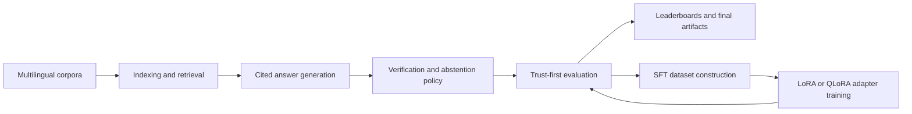

# polyglot-grounded-qa

Multilingual grounded QA research repo focused on one question: can we improve trustworthiness by making answers retrieval-backed, citation-aware, and willing to abstain when evidence is weak?

This repository answers that with a reusable package, notebook-backed experiments, and artifactized evaluations rather than a demo-first app.

## What this repo achieved

As of the latest artifact snapshot, the strongest practical variant is `grounded-heuristic-v1`, evaluated against `baseline-pipeline` with a trust-first rubric on 539 real XQuAD test rows (en/es/es-MX/fr/tr).

| Variant | Practical | Gate pass | Delta trust | Delta answer F1 | Delta citation precision | Delta citation recall |
|---|---:|---:|---:|---:|---:|---:|
| grounded-heuristic-v1 | yes | yes | 0.8169 | 0.9713 | 1.0000 | 1.0000 |
| base-model-prompted-v1 | yes | yes | 0.0980 | 0.0283 | 0.1317 | 0.1317 |
| tuned-adapter-v1 | yes | no | 0.3776 | 0.3091 | 0.5436 | 0.5473 |
| oracle-upper-bound | no | no | 0.8169 | 0.9713 | 1.0000 | 1.0000 |
| tuned-control-baseline | no | no | 0.5766 | 0.0109 | 0.9573 | 0.9573 |

Main takeaways:

- The best non-oracle system materially improves abstention behavior, citation faithfulness, and answer quality at the same time.
- The repo has a reproducible end-to-end evaluation loop with leaderboard artifacts instead of one-off notebook claims.
- The QLoRA adapter (Qwen2.5-3B, 540 steps, loss 2.45 → 0.32) roughly doubles the trust score vs the unprompted base model (0.56 vs 0.28) and shows the strongest citation and answer quality gains among non-oracle practical systems.
- The adapter does not yet pass the promotion gate because it trades a small abstention accuracy regression for much better answer and citation quality.
- The grounded heuristic remains the recommended practical system.

Primary evidence:

- `artifacts/tables/meaningful_result_snapshot.md`
- `artifacts/tables/final_reader_takeaways.md`
- `artifacts/tables/finetune_variant_leaderboard.md`

## Methodology

The project is deliberately organized around trust, not raw answer rate.



The methodology has five parts:

1. Retrieval stays external to the model so knowledge freshness lives in the index, not model weights.
2. Generation is required to ground answers in retrieved chunks and emit explicit citations.
3. Evaluation prioritizes abstention and citation quality, not just answer overlap.
4. Language support is added through language packs and inheritance instead of duplicating pipeline logic.
5. Fine-tuning is treated as a policy-improvement step that must beat the existing grounded heuristic under the same evaluator.

The trust-first composite used in finetune evaluation is:

`grounded_trust_score = 0.2 * abstain_accuracy + 0.3 * citation_precision + 0.3 * citation_recall + 0.2 * answer_token_f1`

Practical variants only get promoted when they improve grounding metrics and avoid answer-quality regressions.

## Read the results first

If you only open a few files, start here:

- `artifacts/tables/meaningful_result_snapshot.md`: concise outcome summary for the latest meaningful run.
- `artifacts/tables/final_reader_takeaways.md`: plain-language interpretation of the final tables.
- `artifacts/tables/finetune_variant_leaderboard.md`: ranking of baseline, heuristic, control, and tuned variants.
- `docs/zero_cost_finetuning_playbook.md`: training strategy for free or low-cost compute.
- `notebooks/80_final_results.ipynb`: narrative walkthrough of final outputs.
- `notebooks/85_colab_adapter_training.ipynb`: GPU-oriented adapter training workflow.

## Repo shape

Core code lives in `src/polyglot_grounded_qa` and is split into a few stable layers:

- `core`: pipeline orchestration and config loading.
- `components`: retriever, reranker, generator, verifier, and abstention interfaces.
- `langpacks`: language-pack contracts and registry.
- `eval`: evaluation logic and trust-focused metrics.

Research artifacts live alongside the code:

- `notebooks`: the narrative path from ingestion to final results.
- `scripts`: reproducible entry points for index building, eval, ablations, data prep, and training.
- `artifacts/runs`: prediction files and run outputs.
- `artifacts/tables`: leaderboard, deltas, summaries, and quality reports.

## What is already reproducible

This repo is strongest when treated as an artifact-backed research pipeline. The shortest path to reproducing the current story is:

```bash
uv sync --extra dev --extra notebooks --extra finetune
uv run python scripts/run_final_results_pipeline.py
```

That refreshes the final evaluation, ablation outputs, reader-facing summaries, and artifact contract checks from the current repo state.

For notebook execution without manual cell running:

```bash
uv run python scripts/run_notebook_batch.py --kernel python3
```

## Local vs GPU-heavy work

Most of the repo is intentionally local and notebook-friendly:

- `notebooks/00` through `notebooks/80_final_results.ipynb`: local CPU is sufficient.
- `notebooks/85_colab_adapter_training.ipynb`: use Kaggle or Colab T4.
- `scripts/train_unsloth_sft.py` and `scripts/run_trained_adapter_eval.py`: best run on Kaggle or Colab when adapter dependencies or GPU memory are a constraint.
- `scripts/build_kg_cache.py` and `scripts/analyze_kg_coverage.py`: CPU-only and suitable for local runs.
- `scripts/analyze_kg_path_quality.py`: CPU-only leakage and support-quality audit for hybrid KG paths.
- `scripts/analyze_hybrid_abstention.py`: CPU-only benchmark-backed abstention comparison for text-only vs hybrid policies.

`scripts/build_kg_cache.py` attempts a small Wikidata-backed cache build first and falls back to the repo's local seed paths when the network is unavailable.

Hybrid retrieval now supports three heuristic policies without any GPU requirement:

- `naive`: plain text-plus-graph fusion.
- `filtered`: drops low-quality graph paths before fusion, but falls back to the single best graph path when strict filtering would remove all graph support.
- `routed`: shifts graph/text weight based on simple question-type routing.

`scripts/run_ablation.py` now evaluates these retrieval variants over a small multilingual query matrix for `base`, `es`, `es-MX`, `fr`, and `tr`, so routing and path filtering are measured on more than a single English query.

Locale-aware retrieval now respects language-pack inheritance for evidence matching, so `es-MX` can reuse `es` graph support instead of being treated as unsupported.

The default retrieval path is also local-first:

- Primary backend: FAISS plus BM25.
- Optional backend: LanceDB for larger local experiments.
- No always-on external vector database is required.

## Fine-tuning stance

This project does not treat fine-tuning as the main story. The current evidence says the most meaningful gains come first from better grounding policy and evaluation discipline.

Fine-tuning exists here to answer a narrower question: can a lightweight adapter outperform the best retrieval-grounded heuristic under the same trust gate?

Current adapter results (Qwen2.5-3B-Instruct, QLoRA rank-16, 540 steps on 4322 real XQuAD rows):

| Metric | Tuned adapter | Base model (prompted) |
|---|---|---|
| Grounded trust score | 0.5607 | 0.2812 |
| Output parse rate | 73.8% (398/539) | 18.2% (98/539) |
| Non-empty answers | 398 | 70 |
| Answers with citations | 249 | 46 |
| Training loss | 2.45 → 0.32 | — |

The adapter clearly learned the grounded QA format and nearly doubled the trust score vs the base model. It produces well-structured JSON output with citations at 4× the rate of the unprompted base model.

However, the adapter has not yet cleared the practical promotion gate: it trades a small abstention accuracy regression for much stronger answer and citation quality. The grounded heuristic remains the top practical system.

Infrastructure in place:

- SFT data pipeline generates train/val/test splits from real XQuAD with hard negatives.
- Free-compute training paths exist for MLX LoRA (local) and Unsloth QLoRA (Kaggle T4).
- The tuned adapter is measurable with the same trust-first evaluator used for all variants.
- Adapter artifacts are published to Kaggle and synced locally via contract-checked pipelines.

## Minimal commands

If you want only the essential entry points, use these:

```bash
# Build or refresh an index
uv run python scripts/build_index.py

# Build or refresh the seed KG cache
uv run python scripts/build_kg_cache.py

# Force a fully local seed-only KG cache rebuild
uv run python scripts/build_kg_cache.py --offline --refresh

# Run the baseline pipeline on one query
uv run python scripts/run_pipeline.py "What is grounded QA?" --language base

# Run the hybrid pipeline with heuristic routing
uv run python scripts/run_pipeline.py "What is grounded QA?" --language base --retrieval-mode hybrid --hybrid-policy routed

# Run a graph-coverage audit
uv run python scripts/analyze_kg_coverage.py

# Audit graph path quality and leakage risk
uv run python scripts/analyze_kg_path_quality.py

# Compare text-only and graph-aware abstention policies on benchmark labels
uv run python scripts/analyze_hybrid_abstention.py

# Run evaluation
uv run python scripts/run_eval.py

# Run ablations
uv run python scripts/run_ablation.py

# Build SFT data
uv run python scripts/run_finetune_data_pipeline.py --no-public
```

Training presets:

- `configs/finetune/local_mlx_lora.yaml`
- `configs/finetune/cloud_unsloth_qlora.yaml`

## Current limitations

- The verifier is still not a mature final component.
- The best trained adapter nearly doubles trust vs the base model but does not yet beat the grounded heuristic on the full promotion gate (abstention accuracy regresses slightly).
- There are no checked-in figure assets yet; the strongest evidence currently lives in markdown tables and parquet outputs.
- The base model's low parse rate (18.2%) means many test rows produce unusable output without fine-tuning, underscoring the adapter's value for format compliance.

## Why this repo is interesting

The contribution here is not just that multilingual grounded QA runs. It is that the repo makes the tradeoffs inspectable:

- how retrieval and citation behavior affect trust,
- how abstention changes practical system quality,
- how language packs let one pipeline stretch across locales,
- and where fine-tuning actually helps or fails.

That makes this repo more useful as a research scaffold than a one-shot benchmark dump or a thin notebook collection.
